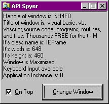



## API Spyer

### Description

The API Spyer tracks any window that the mouse is over, giving info such as the window handle (hWnd), its class name, its text, etc. This program also allows you to change the text of a window, get its hDC and Window Rect, and change its enabled and visible states. The API Spyer also features self-immunity so that it will not track itself (so you can click on the command button to change the current window, for instance) and can be set to stay on top.

Note: beware as to what windows you are hiding/disabling because you might not be able to show/enable them again (like the desktop windows).
 
### More Info
 

             |
---                |---
**Submitted On**   |2000-03-23 21:10:16
**By**             |[Steve Weller](https://github.com/Planet-Source-Code/PSCIndex/blob/master/ByAuthor/steve-weller.md)
**Level**          |Intermediate
**User Rating**    |4.7 (66 globes from 14 users)
**Compatibility**  |VB 3\.0, VB 4\.0 \(16\-bit\), VB 4\.0 \(32\-bit\), VB 5\.0, VB 6\.0, VB Script, ASP \(Active Server Pages\) 
**Category**       |[Windows API Call/ Explanation](https://github.com/Planet-Source-Code/PSCIndex/blob/master/ByCategory/windows-api-call-explanation__1-39.md)
**World**          |[Visual Basic](https://github.com/Planet-Source-Code/PSCIndex/blob/master/ByWorld/visual-basic.md)
**Archive File**   |[CODE\_UPLOAD7494762000\.zip](https://github.com/Planet-Source-Code/steve-weller-api-spyer__1-9563/archive/master.zip)

